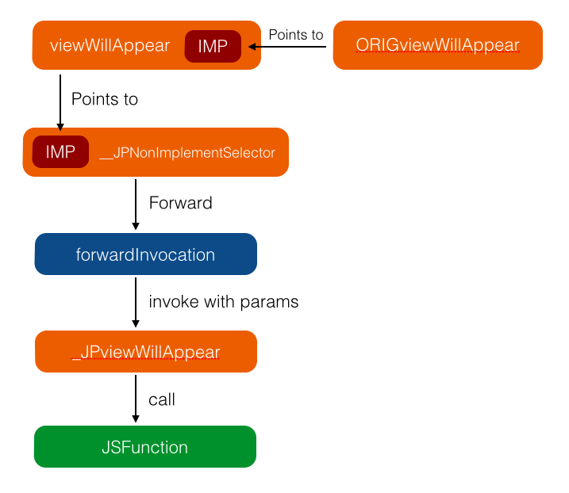

# JSPatch

## JSPatch产生背景
热修复技术（hot-fix）因为苹果AppStore审核周期比较长，一旦出现严重bug难以快速上限新版本，为此JSPatch应运而生

## JSPatch简介
JSPatch诞生于2015年5月，最初是腾讯广研高级iOS开发@bang的个人项目。

它能够使用JavaScript调用Objective-C的原生接口，从而动态植入代码来替换旧代码，已实现修复线上bug
## JSPatch实现原理
###基础原理
Objective－C是动态语言,具有运行时特性，该特性可通过类名称和方法名的字符串获取该类和该类的方法

~~~
 Class class = NSClassFromString(“UIViewController");
 id viewController = [[class alloc] init];  
 SEL selector = NSSelectorFromString(“viewDidLoad");
 [viewController performSelector:selector];
~~~
也可以替换某个类的方法为新的实现：

~~~
static void newViewDidLoad(id slf ,SEL sel){}
class_replaceMethod(class,selector, newViewDidLoad,@"")
~~~
还可以新注册一个类，为类添加方法：

~~~
Class cls = objc_allocateClassPair(superCls,"JPObject",0);
objc_registerClassPair(cls);
class_addMethod(cls,selector,implement,typedesc);
~~~
### Javascript调用
我们可以用Javascript对象定义一个Objective-C类：

~~~
{
	__isCls: 1,
	_clsName: "UIView"
}
~~~
在OC执行JS脚本前，通过正则把所有方法调用都改成调用__c()函数，再执行这个JS脚本，做到了类似OC/Lua/Ruby等的消息转发机制：

~~~
UIView.alloc().init()
->
UIView.__c('alloc')().__c('init')()
~~~
给JS对象基类Object的prototype加上c成员，这样所有对象都可以调用到c,根据当前对象类型判断进行不同操作：

~~~
Object.prototype.__c = function(methodName) {
	if(!this.__obj && !this.__clsName) return this[methodName].bind(this);
	var self = this
	return function(){
		var args = Array.prototype.slice.call(arguments)
		return _methodFunc(self.__obj,self.__clsName,methodName,args, self.__isSuper)
	}
}
~~~

###互传消息
JS和OC是通过JavaScriptCore互传消息的。OC端在启动JSPatch引擎时会创建一个JSContext实例，JSContext是JS代码的执行环境，可以给JSContext添加方法。JS通过调用JSContext定义的方法把数据传给OC，OC通过返回值传给JS。调用这种方法，它的参数／返回值JavaScriptCore都会自动转换，OC里的NSArray，NSDictionary，NSString，NSNumber，NSBlock会分别转为JS端的数组／对象／字符串／数字／函数类型。

对于一个自定义id对象，JavaScriptCore会把这个自定义对象的指针转给JS，这个对象在JS无法使用，但在回传给OC时OC可以找到这个对象。对于这个对象生命周期的管理，如果JS有变量引用时，这个对象的引用计数就加1，JS变量的引用释放了就减1，如果OC上没别的持有者，这个OC对象的生命周期就跟着JS走了，会在JS进行垃圾回收时释放。
###方法替换
1、把UIViewController的viewWillAppear：方法通过class_replaceMethod()接口指向_objc_msgForward,这是一个全局IMP，OC调用方法不存在时都会转发到这个IMP上，这里直接把方法替换成这个IMP，这样调用这个方法时就会走到－forwardInvocation:。

2、为UIViewController添加－ORIGviewWillAppear:和－_JPViewWillAppear：两个方法，前者指向IMP，后者则是新的实现，稍后会在这个实现里回调JS函数。

3、改写UIViewController的－forwardInvocation：方法为自定义实现。一旦OC里调用UIViewController的－viewWillAppear：方法，经过上面的处理会把这个调用转发到－forwardInvocation，这时已经组装好了一个NSInvocation，包含了这个调用的参数。在这里把参数从NS Invocation反解出来，带着参数调用上述新增加的方法－JPviewWillAppear：，在这个新方法里取到参数传给JS，调用JS的实现函数。整个调用过程就结束了，整个过程图示如下：

最后一个问题，我们把 UIViewController 的 -forwardInvocation: 方法的实现给替换掉了，如果程序里真有用到这个方法对消息进行转发，原来的逻辑怎么办？首先我们在替换 -forwardInvocation: 方法前会新建一个方法 -ORIGforwardInvocation:，保存原来的实现IMP，在新的 -forwardInvocation: 实现里做了个判断，如果转发的方法是我们想改写的，就走我们的逻辑，若不是，就调 -ORIGforwardInvocation: 走原来的流程。

## 开放平台
[**JSPatch开放平台入口**] (http://jspatch.com)

[**JSPatch开放平台参阅文档**] (http://jspatch.com/Docs/intro)

[**JSPatch开放平台接入指南**] (http://jspatch.com/Docs/api)

[**JSPatch开放平台SDK下载**] (http://jspatch.com/Index/sdk)

## 参阅资料
[**JSPatch基础用法**] (https://github.com/bang590/JSPatch/wiki/JSPatch-基础用法)

[**JSPatch常见问题**] (https://github.com/bang590/JSPatch/wiki/JSPatch-常见问题)

[**更多**] (https://github.com/bang590/JSPatch/wiki)

I